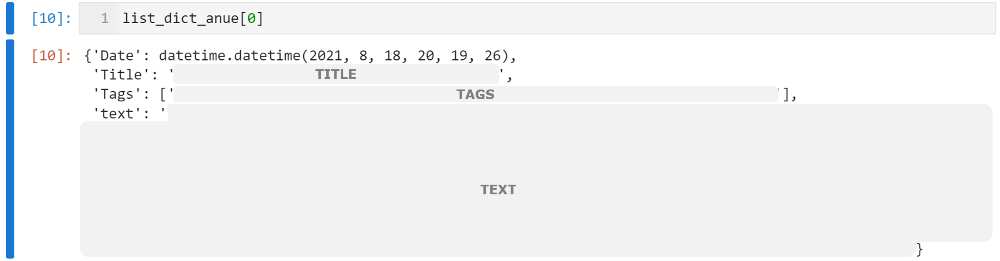

# **Anue**

## **Category**

|中文|category|
|:---:|:---:|
|即時頭條|headline|
|A股港股|cn_stock|
|外匯|forex|
|台股|tw_stock|
|期貨|future|
|國際股|wd_macro|

```python
from Anue.anue import ANUE_CAT

ANUE_CAT.cat

>>> {'即時頭條': 'headline',
	 'A股港股': 'cn_stock',
 	 '外匯': 'forex',
 	 '台股': 'tw_stock',
 	 '期貨': 'future',
 	 '國際股': 'wd_macro'}
```

## **URL Format**
```python
from Anue.anue import ANUE_URL

ANUE_URL.v3
>>> 'https://news.cnyes.com/api/v3/news/category/{cat}?startAt={t1}&endAt={t2}&limit=30&page={page}'
'''
cat --> Category
t1, t2 --> start, end (timestamp)
page --> page
'''
```
### **timestamp**
```python
from Anue.anue import ANUE

ANUE.period_to_timestamp(1)

>>> [1629205837, 1629292237]

'''
最近1日的timestamp
'''
```
## 抓取Anue
### **STEP 1 設定相關資訊**
```python
from Anue.anue import ANUE

anue = ANUE(category = 'tw_stock',
            period = 2) #最近的2天

'''
from Anue.anue import ANUE_CAT

ANUE_CAT.cat = {'即時頭條': 'headline',
                'A股港股': 'cn_stock',
                '外匯': 'forex',
                '台股': 'tw_stock',
                '期貨': 'future',
                '國際股': 'wd_macro'}
'''
```
### **STEP 2 開始抓取**
```python
list_dict_anue = anue.crawler_all()
```
### **回傳資料型態**
```python
type(list_dict_anue)
>>> list

type(list_dict_anue[0])
>>> dict 
```
<center>
	
</center>
